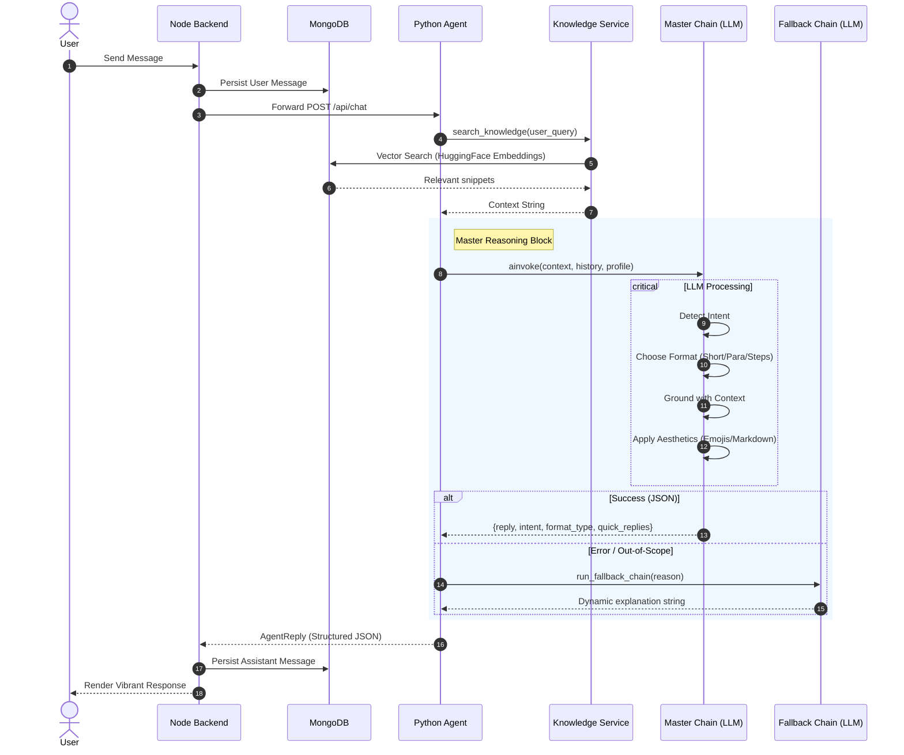

# TrustTrade AI Agent 🚀

Python AI layer for TrustTrade. This service handles chat reasoning, retrieval, and strategic business workflows using a **Pure LLM-First** functional architecture.

## 🌟 Key Features

- **Brain-in-a-Box**: Consolidated "Master Chain" that handles intent, grounding, and formatting in a single LLM pass.
- **Dynamic Formatting**: Automatically switches between `short`, `paragraph`, and `step-by-step` responses based on user needs.
- **Rich Aesthetics**: Built-in support for Emojis and Rich Markdown (headers, bolding, blockquotes) for a premium interface.
- **Persona-Aware**: Tailors responses based on the user's name and role (Member/Seller).
- **Proactive Fallbacks**: Custom fallback chain for out-of-scope requests or system errors.

## 🏗️ Architecture

- `api/` - FastAPI endpoints and server lifecycle logic.
- `apps/chat_service/` - Orchestration, Knowledge retrieval, and Master/Fallback chains.
- `apps/purchasing_service/` - Strategic buying workflows using LangGraph.
- `shared/` - Pydantic schemas and global configuration.

## 📊 Request Flow

### 1. Conversation Mode
1. **Frontend / Node**: Message received and stored; forwarded to Python Agent.
2. **Knowledge Retrieval**: LangChain-native vector search finds relevant context from MongoDB.
3. **Master Reasoning**: 
    - LLM analyzes context, user profile, and history.
    - LLM detects **Intent** and chooses the best **Format Type**.
    - LLM generates a structured JSON response.
4. **Validation**: Orchestrator validates the result against the `AgentReply` schema.
5. **Return**: Structured reply sent back to Node for frontend rendering.

### 2. Sequence Diagram



## 📜 Data Contract (AgentReply)

Every response from the agent follows this strict Pydantic schema:

| Field | Type | Description |
| :--- | :--- | :--- |
| `reply` | `string` | The main conversational text (contains Markdown and Emojis). |
| `intent` | `string` | Detected user purpose (e.g., `listing`, `general`, `support`). |
| `format_type`| `string` | `short`, `paragraph`, or `steps`. |
| `quick_replies`| `array` | List of suggested button labels for the user. |
| `source` | `string` | Source identifier (default: `python-agent`). |

---

## 🛠️ Setup & Development

```bash
# Install dependencies
cd Agent
pip install -r requirements.txt

# Run the agent in reload mode
python3 main.py
```

### Knowledge Rebuild
Update files in `apps/chat_service/data/` then run:
```bash
python3 scripts/build_website_embeddings.py
```

## 📂 Core Runtime Files
- [api/main.py](./api/main.py) - Entrypoint
- [apps/chat_service/services/chat_service.py](./apps/chat_service/services/chat_service.py) - Orchestrator
- [apps/chat_service/chains/master_chain.py](./apps/chat_service/chains/master_chain.py) - Core Brain
- [apps/chat_service/chains/fallback_reply.py](./apps/chat_service/chains/fallback_reply.py) - Fallbacks
