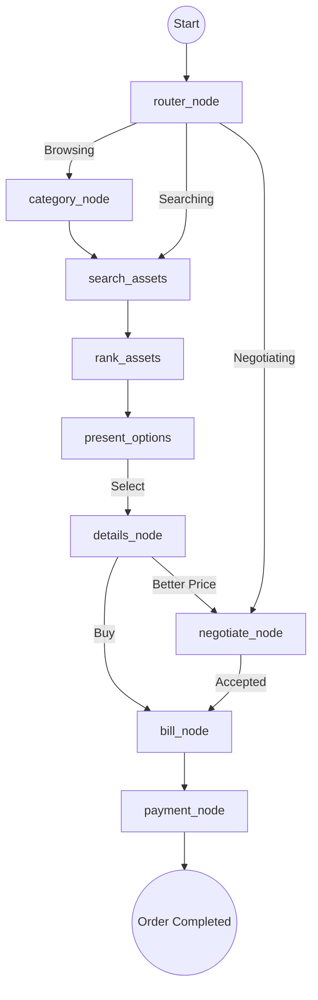

# TrustTrade AI Agent 🚀

Python-powered agentic layer for TrustTrade. This service handles advanced reasoning, multi-node workflows, and RAG-based business intelligence using a **LangGraph-driven** architecture.

## 🌟 Key Features

- **Strategic AI Negotiator**: A specialized node that manages price negotiations using rational counter-offers and market-aware reasoning.
- **RAG-based Grounding**: Retrieval-Augmented Generation using LangChain and MongoDB Vector Search to provide accurate, context-aware answers about business assets.
- **Agentic Workflow**: A persistent state machine (LangGraph) that guides users through the entire lifecycle: Discovery → Selection → Negotiation → Billing.
- **Master Chain Reasoning**: Consolidated "Master Chain" that handles intent detection, persona-aware grounding, and dynamic formatting in a single pass.
- **Real-Time Inventory Lock**: Integrated with the backend to reserve assets during the negotiation/checkout phase.

## 🏗️ Architecture

- `api/` - FastAPI endpoints for seamless integration with the Node.js backend.
- `apps/chat_service/` - RAG-based conversational engine and general knowledge retrieval.
- `apps/purchasing_service/` - The core "Strategic Purchasing Agent" implemented as a stateful LangGraph.
- `shared/` - Pydantic schemas, shared utilities, and global environment configuration.

## 📊 Agentic Workflow (Strategic Purchase)

The agent operates as a directed graph where each node represents a specific business logic state.



## 📜 Data Contract (AgentReply)

Every response follows a strict schema for frontend compatibility:

| Field | Type | Description |
| :--- | :--- | :--- |
| `reply` | `string` | Markdown-formatted text with Emojis and reasoning. |
| `intent` | `string` | Detected intent (e.g., `negotiate`, `search`, `payment`). |
| `quick_replies`| `array` | Dynamic buttons (e.g., "Accept Offer", "Try Again"). |
| `metadata` | `object` | Persistent session state (category, selected_asset, etc). |

---

## 🛠️ Setup & Development

```bash
# Install dependencies
cd Agent
pip install -r requirements.txt

# Run the agent (FastAPI)
python3 main.py
```

### Rebuilding Knowledge Base (RAG)
To update the knowledge base with new business docs:
1. Add text/markdown files to `apps/chat_service/data/`.
2. Run the embedding script:
```bash
python3 scripts/build_website_embeddings.py
```

## 📂 Core Runtime Files
- [main.py](./main.py) - FastAPI Entrypoint
- [apps/purchasing_service/builder.py](./apps/purchasing_service/builder.py) - LangGraph Construction
- [apps/purchasing_service/router.py](./apps/purchasing_service/router.py) - Intent Orchestration
- [apps/purchasing_service/nodes/purchase/negotiate_node.py](./apps/purchasing_service/nodes/purchase/negotiate_node.py) - Strategic Negotiator Logic
