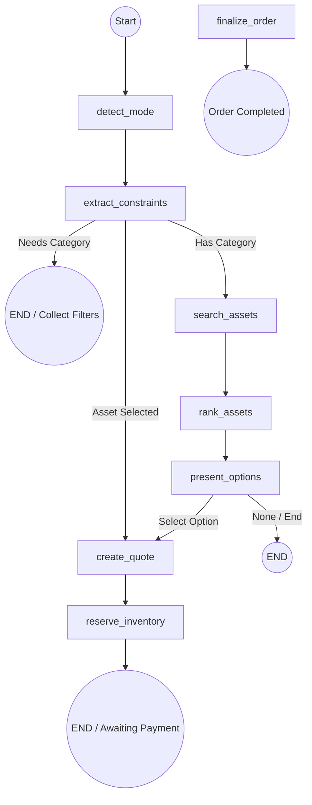

# LangGraph Flow: Strategic Purchase Agent

This document outlines the node-based architecture and state transitions for the TrustTrade Agentic AI (v5.0).

## Workflow Diagram

## Node Descriptions

### 1. `detect_mode`
- **Purpose**: Analyzes the user's intent to decide between a general conversation or a structured purchase flow.
- **Triggers**: Keywords like "buy", "find", "order", "category".

### 2. `extract_constraints`
- **Purpose**: Uses regex and (optionally) LLM logic to pull structured data from natural language.
- **Data Points**: `budgetMax`, `category`, `quantity`.
- **Logic**: If a category is missing, it interrupts the flow to ask the user for one via quick replies.

### 3. `search_assets`
- **Purpose**: Bridges the Agent and the Backend. Calls the Discovery Service to find available assets.
- **Input**: Extracted constraints.
- **Output**: A list of asset IDs stored in state metadata.

### 4. `rank_assets`
- **Purpose**: Processes the search results to determine the best match.
- **Logic**: Implements Phase 15.B (Explainability) by generating a reasoning string (e.g., "This item fits your budget and has the best ratings").

### 5. `present_options`
- **Purpose**: Formats the ranked results into a user-readable list.
- **Interface**: Provides numbered options and quick replies like "Select Option 1".

### 6. `create_quote`
- **Purpose**: The "Source of Truth" for pricing. Calls the backend pricing engine to generate a real-time quote.
- **Includes**: Platform fees (3%), taxes, and total cost.

### 7. `reserve_inventory`
- **Purpose**: Ensures the user doesn't lose the item during checkout.
- **Action**: Atomically locks the inventory for 15 minutes.
- **Status**: Changes state to `awaiting_confirmation`.

### 8. `finalize_order`
- **Purpose**: The terminal state of a successful transaction.
- **Action**: Confirms the order in the database and notifies the seller.

---

## State Model (`AgentPurchaseState`)
The agent maintains a persistent state across these nodes:
- `mode`: 'conversation' | 'agent'
- `query`: The raw user input
- `step`: Current progress (e.g., 'showing_options', 'quoted')
- `metadata`: Large objects like search results or active quote details.
